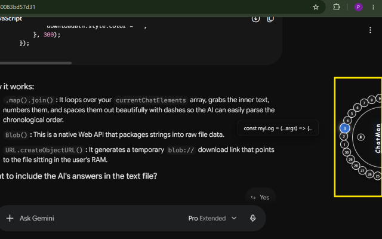

# ChatMan
Chrome Extension : https://chromewebstore.google.com/detail/chatmanager/kgpfgfigifjifegdgcchanmedpiopbpn?authuser=0&hl=en-GB
# ChatMan (ChatManager)

> **Revamp your AI user experience.**

ChatMan is an accessibility and productivity tool designed to elevate everyday AI usage, primarily tailored for **Google Gemini**. It streamlines navigating long, sprawling conversations and makes cross-platform context sharing effortless.



---

## Key Features

- **Seamless Thread Navigation:** Jump to any turn in your conversation with a single click on a floating, rotary dial positioned cleanly on the right side of the screen.
- **Dynamic Equispaced Dial:** After every message exchange, the dial dynamically populates with equispaced numbered nodes representing each turn. Rotate the dial with your scroll wheel or drag to navigate conversations from start to finish.
- **Portability via Markdown Export:** Download your complete chat history with one click as a `.md` file, ready to import into other AI models, notebooks, or archival systems.
- **Playful, Tactile UI:** Smooth rotational mechanics turn thread navigation into an intuitive, tactile experience.

---

## How It Works

1. **Auto-Populate:** As you chat, ChatMan listens to thread DOM updates via a mutation observer and adds nodes to the dial.
2. **Rotate & Peek:** Hover over any numbered node to preview the prompt snippet, or use your scroll wheel to spin the dial.
3. **Jump:** Click any node to instantly scroll the viewport to that exact message block.
4. **Export:** Click the download icon to generate a formatted Markdown summary of the entire session.

---

## Project Structure

```text
ChatMan/
├── background/
│   └── service_worker.js     # Lifecycle listener & tab event monitoring
├── content/
│   ├── content-gemini.js     # Rotary dial logic, jumping, and export for Gemini
│   ├── content-chatgpt.js    # ChatGPT integration handler
│   ├── content-claude.js     # Claude integration handler
│   ├── content.css           # Dial animations, layout, and preview tooltip styles
│   └── utils/
│       ├── initial.js        # DOM polling & initialization helpers
│       └── logger.js         # Logging & event utilities
├── icons/                    # Browser extension action icons
├── popup/
│   └── popup.html            # Extension action popup
├── ss/
│   └── usage-1.png           # Interface demo preview
└── manifest.json             # Manifest V3 extension configuration
